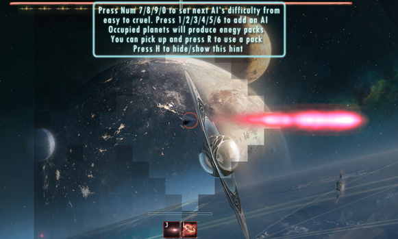
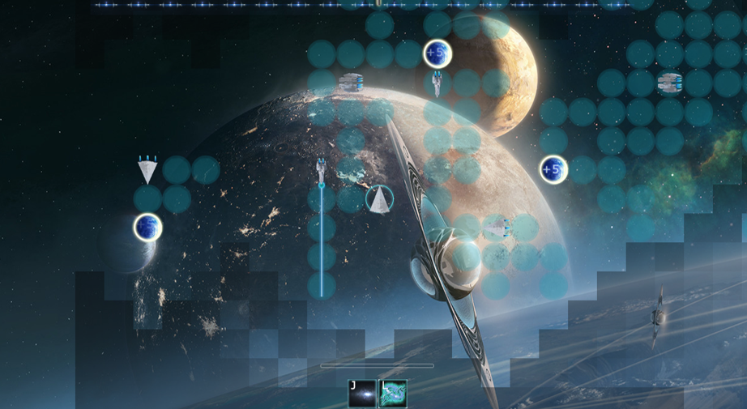
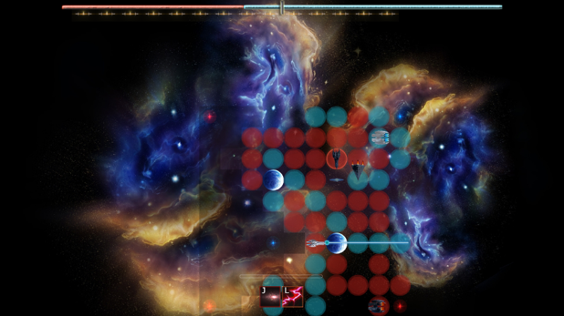

# SamuraiEL
A [libGDX](https://libgdx.badlogicgames.com/) 2D game for NJU EL competition, made in two months

The real title of this game is __Colony__

1. [Introduction](#1-introduction)
2. [Download](#2-download)
3. [Received award](#3-received-award)
4. [Acknowledgement](#4-acknowledgement)
5. [Screenshots](#5-screenshots)

## 1. Introduction

Republic and Union, as the two major opposing human forces, have been fighting for space resources for a long time. While a new kind of particle is found in a neutral galaxy, which can efficiently produce high energy or act as a optical invisible material, the two forces have sent their fleet to this area, starting a space war. Some elite ships have already been equipped with the particle to enhance their firepower and survivability. 

Choose your favorite elite battleship from three different types with their characteristic weapon and skill, follow the in-game tutorial and enjoy either the standard tricky 3v3 or the massive 8v8 intense fight.

## 2. Download
Single jar file:

[Baidu](https://pan.baidu.com/s/1dEJmyhb)

## 3. Received award
Our team ranked second among roughly 50 participating ones and eventually received the second prize of the competition

## 4. Acknowledgement
Most of the game assets were downloaded from the Internet, and without these open resources we couldn't make such a complete game. All assets in this game should not be used for business purpose unless permitted by their original authors

Besides, our concept design is mainly inspired by _Gundam_ and _Star Wars_
## 5. Screenshots

